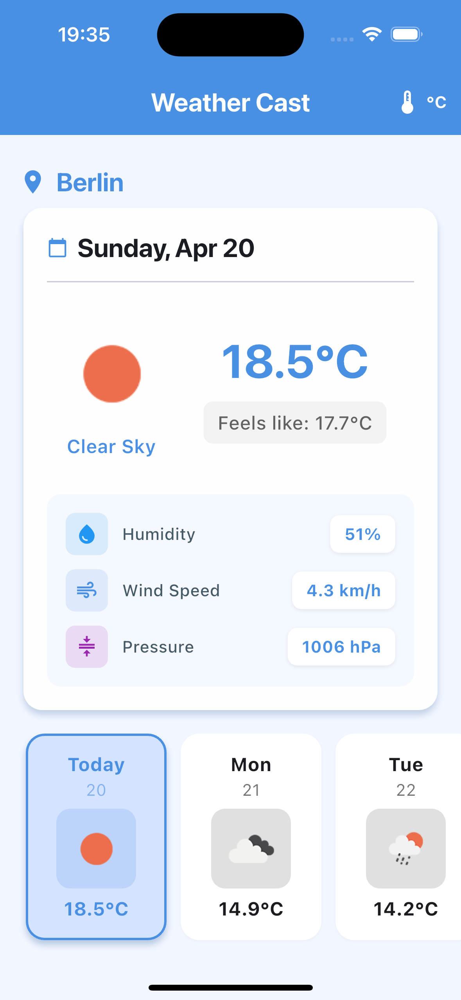

# Weather Cast

A Flutter weather forecasting application that displays current weather and a weekly forecast.

<div align="center">
 
</div>

## Overview

Weather Cast is a mobile application built with Flutter that provides real-time weather information and forecasts. The app showcases clean architecture principles, state management with BLoC/Cubit.

The application leverages the 5-day forecast API from [OpenWeatherMap](https://openweathermap.org/api) to collect comprehensive weather data. This data is intelligently processed to categorize forecasts by day, calculating daily average temperatures and other weather metrics. The app then presents this information in an intuitive, user-friendly interface that makes it easy to track weather patterns throughout the week.

## Features

- Display current weather conditions
- Show 5-day weather forecast
- Toggle between Celsius and Fahrenheit temperature units
- Pull-to-refresh functionality to update weather data
- Clean architecture implementation

## Getting Started

### Prerequisites

- Flutter SDK (version 3.27.4)
- Dart SDK (version ^3.5.0)
- OpenWeatherMap API key

This project was developed using Flutter 3.27.4. We use [FVM (Flutter Version Management)](https://fvm.app/) to ensure consistent Flutter versions. The project includes a [.fvmrc](.fvmrc) file that specifies the Flutter version.

### Installation

1. Clone the repository
2. Navigate to the project directory
3. Run `flutter pub get` to install dependencies
4. Update the API key in [`lib/core/constants/api_constants.dart`](lib/core/constants/api_constants.dart) with your own key
5. Run the app with `flutter run`

If you're using FVM:

```
fvm install
fvm flutter pub get
fvm flutter run
```

## Architecture

The application follows Clean Architecture principles with a clear separation of concerns:

### Layers

- **Presentation**: Contains UI components, BLoC/Cubit state management
- **Domain**: Contains business logic, use cases, and entity models
- **Data**: Contains data sources, repositories, and data models

### Key Technologies & Libraries

- **Flutter**: UI framework
- **bloc/flutter_bloc**: State management
- **dio**: HTTP client for API requests
- **get_it**: Dependency injection
- **dartz**: Functional programming utilities
- **freezed**: Immutable state management
- **shared_preferences**: Local storage
- **connectivity_plus**: Network connectivity monitoring
- **cached_network_image**: Efficient image loading and caching

## API

The app uses the OpenWeatherMap API for fetching weather data. You'll need an API key from [OpenWeatherMap](https://openweathermap.org/api) to run the application.

### API Implementation Details

The app integrates with the OpenWeatherMap API through the following components:

- **WeatherRemoteDataSource**: Responsible for making API calls to the OpenWeatherMap 5-day forecast endpoint using Dio HTTP client
- **ApiClient**: A wrapper around Dio that handles network requests, error handling, and response parsing
- **ForecastResult model**: Data models that parse and map the JSON responses from the API to Dart objects using Freezed for immutability

### Use Cases & Data Flow

The application implements Clean Architecture with a well-defined flow of data:

1. **Data Acquisition**:

   - `GetWeatherForecastUseCase`: Fetches raw weather data from the repository
   - The repository handles the selection between remote (API) and local (cached) data sources

2. **Data Processing**:

   - `AggregateWeeklyForecastUseCase`: Transforms raw forecast data into user-friendly structured data by:
     - Grouping forecasts by day
     - Finding the most representative weather condition for each day
     - Calculating average weather metrics (temperature, humidity, etc.)
     - Identifying the current forecast for today

3. **Presentation Layer**:
   - `WeatherCubit`: Manages state using the BLoC pattern
   - Orchestrates the execution of use cases and transforms domain entities into UI-ready state
   - Handles user interactions like refreshing data, selecting days, and toggling temperature units

This architecture ensures separation of concerns, testability, and maintainability while providing a clean flow of data from the API to the UI.

## Project Structure

```
lib/
├── core/               # Core functionalities and utilities
│   ├── constants/      # App-wide constants
│   ├── di/             # Dependency injection
│   ├── errors/         # Error handling
│   ├── network/        # Network client and utilities
│   ├── themes/         # Theme configuration
│   ├── widgets/        # Reusable widgets
│   └── extensions/     # Extension methods
├── features/           # Feature modules
│   └── weather/        # Weather feature
│       ├── data/       # Data layer
│       │   ├── datasources/  # Remote and local data sources
│       │   ├── models/       # Data models
│       │   └── repositories/ # Repository implementations
│       ├── domain/     # Domain layer
│       │   ├── entities/     # Business entities
│       │   ├── repositories/ # Repository interfaces
│       │   └── usecases/     # Business use cases
│       └── presentation/ # Presentation layer
│           ├── cubit/       # State management
│           ├── pages/       # Screen components
│           ├── widgets/     # UI components
│           └── utils/       # Presentation utilities
└── main.dart           # Application entry point
```
